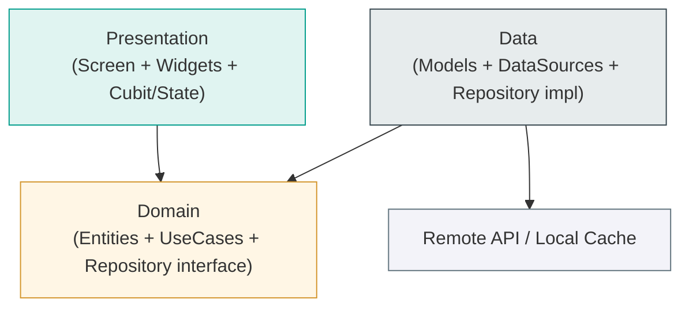
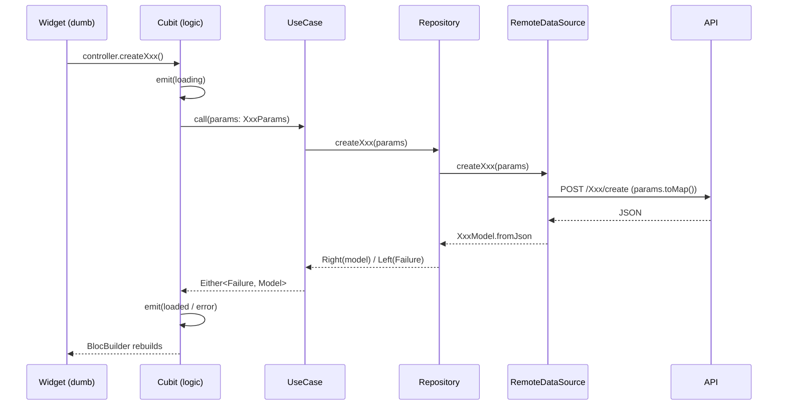
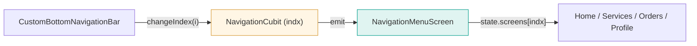

# 📦 Feature Template & Coding Standard

> Copy this file into any new Flutter app. It teaches both **you** and **AI agents**
> exactly how features are written here: Clean Architecture + Cubit, with strict
> conventions for colors, sizes, text styles, localization, navigation, and UI.
>
> Rule of thumb: **when unsure, copy an existing feature, rename, fill the API.**

---

## 1. Architecture at a glance



**Dependency rule:** outer depends on inner. `presentation → domain`, `data → domain`,
`domain → nothing`. Never import `data` from `presentation`.

---

## 2. Data flow for one action (e.g. "Create request")



**Key idea:** widgets never call APIs. They call cubit methods. The cubit holds all logic.

---

## 3. Folder structure (per feature)

```
lib/features/<feature>/
├── data/
│   ├── data_sources/
│   │   └── remote_data_sources.dart      # abstract + impl
│   ├── model/
│   │   └── <feature>/
│   │       ├── xxx_model.dart             # extends entity, fromJson/toJson
│   │       └── create_xxx_model.dart      # create-response model
│   └── repositories/
│       └── repository.dart               # implements domain repo
├── domain/
│   ├── entity/
│   │   └── <feature>/
│   │       ├── xxx_lookup.dart            # Equatable, NO json
│   │       └── create_xxx.dart            # response entity
│   ├── repository/
│   │   └── repository.dart               # abstract interface
│   └── use_cases/
│       └── <feature>/
│           ├── create_xxx_use_case.dart  # + CreateXxxParams { toMap() }
│           ├── update_xxx_use_case.dart
│           └── get_xxx_types_use_case.dart
└── presentation/
    ├── controller/<feature>/
    │   ├── xxx_cubit.dart
    │   └── xxx_state.dart                 # part of cubit
    ├── screens/<feature>/
    │   ├── create_xxx_screen.dart         # thin composition
    │   └── widget/                        # one file per section
    │       ├── xxx_request_data_widget.dart
    │       └── xxx_info_tile.dart
    └── ...
```

---

## 4. Golden Rules (the short list)

| # | Rule | ✅ Do | ❌ Never |
|---|------|------|---------|
| 1 | Colors | `ColorRes.primary` | `Colors.red`, `Color(0xFF…)` |
| 2 | Sizes / radius / padding | `AppSizes.padding` | raw numbers `16`, `12` |
| 3 | Empty spacing gaps | `const Sizer(height: 12)` | `SizedBox(height: 12)`, `Sizer(height: 12.h)`, `Sizer(height: AppSizes.md)` |
| 4 | Images / icons | `AssetRes.logo` | `'assets/images/logo.png'` |
| 5 | Text style | `Theme.of(context).textTheme.bodyLarge?.copyWith(...)` | raw `TextStyle(...)` |
| 6 | Strings | `S.current.login` | `'Login'` |
| 7 | Const | `const Sizer(height: 8)` everywhere possible | non-const when it could be const |
| 8 | Widgets | `StatelessWidget` by default | `StatefulWidget` unless you truly need local mutable state |
| 9 | UI building blocks | **separate file + public class** | `_PrivateWidget` inside the screen |
| 10 | Navigation | `context.pushNamed(DRoutesName.xxx)` | `Navigator.of(context).pushNamed('literal')` |
| 11 | UseCase payload | `XxxParams { toMap() }`, else `NoParams` | passing raw maps around |
| 12 | DI | UseCase = `LazySingleton`, Cubit = `Factory` | singleton cubit |
| 13 | Loading | `Skeletonizer` / `CustomUI.simpleLoader()` | bare `CircularProgressIndicator` for full screens |
| 14 | Empty / error / snackbar | `CustomUI.emptyData()`, `CustomUI.snackBarFailure()` | re-inventing them per screen |
| 15 | Many states/options | an `enum` + extension getters | scattered bool flags or magic strings |

---

## 5. Style usage with examples

### 5.1 Text styles — always from Theme + copyWith
```dart
// ✅
Text(
  S.current.title,
  style: Theme.of(context).textTheme.headlineSmall?.copyWith(
        color: ColorRes.black,
        fontWeight: FontWeight.w700,
      ),
)
// ❌ never
Text('Title', style: TextStyle(fontSize: 18, fontWeight: FontWeight.bold))
```
Raw font sizes/families live ONLY in `DTextTheme`. Widgets override `color` / `fontWeight` / occasionally `fontSize: AppSizes.fontSizeMd`.

### 5.2 Colors — `ColorRes`
```dart
color: ColorRes.primary,
color: ColorRes.primary.withValues(alpha: 0.1), // tints
border: Border.all(color: ColorRes.grey5),
```
**Never use raw `Colors.xxx` or `Color(0x...)` in UI widgets.**

### 5.3 Sizes — `AppSizes` (ScreenUtil-backed)
```dart
padding: EdgeInsets.all(AppSizes.padding),
borderRadius: BorderRadius.circular(AppSizes.borderRadiusLg),
Icon(Icons.add, size: AppSizes.iconMd),
```
Use `AppSizes` for padding, radius, icon sizes, button sizes, and fixed widget dimensions.

### 5.4 Spacing — `Sizer`
```dart
const Sizer(height: 16),   // vertical gap
const Sizer(width: 8),     // horizontal gap
```
Use `Sizer` for empty gaps only. **Never use empty `SizedBox`.**
Pass raw design numbers because `Sizer` already applies `flutter_screenutil` internally:

```dart
// Good
const Sizer(height: 8);
const Sizer(width: 12);

// Bad
SizedBox(height: 8);
Sizer(height: 8.h);
Sizer(height: AppSizes.sm);
Sizer(width: double.infinity);
```

### 5.5 Images / icons — `AssetRes`
```dart
Image.asset(AssetRes.logoWithName, width: AppSizes.widthcontainer),
SvgPicture.asset(AssetRes.menuIcon, color: ColorRes.white),
```

### 5.6 const + StatelessWidget
- Mark every widget `const` when its inputs are const. It skips rebuilds → faster app.
- Default to `StatelessWidget`. Only use `StatefulWidget` for genuinely local, view-only
  state (animation controllers, a toggle that no other layer cares about). Form state,
  API state, controllers → all live in the **Cubit**, not the widget.

### 5.7 Prefer separate widget classes over private inline ones (UI)
```dart
// ✅ separate file: widget/xxx_info_tile.dart  → public class XxxInfoTile
// then in screen:
const XxxInfoTile(label: ..., value: ...),

// ❌ avoid private inline classes for reusable UI
class _InfoTile extends StatelessWidget { ... }  // only OK for tiny, single-use bits
```
Separate public widget classes are reusable, testable, `const`-able, and keep screens short.

---

## 6. THE TEMPLATE — copy these files and rename `Xxx`

### 6.1 Domain · Entity — `domain/entity/xxx/xxx_lookup.dart`
```dart
import 'package:equatable/equatable.dart';

/// A dropdown lookup option (id + bilingual name). No JSON here — pure domain.
class XxxLookup extends Equatable {
  final int id;
  final String nameAr;
  final String nameEn;

  const XxxLookup({
    required this.id,
    required this.nameAr,
    required this.nameEn,
  });

  @override
  List<Object?> get props => [id, nameAr, nameEn];
}
```

### 6.2 Domain · UseCase + Params — `domain/use_cases/xxx/create_xxx_use_case.dart`
```dart
import 'package:dartz/dartz.dart';
import '../../../../../core/error/failure.dart';
import '../../../../../core/utils/usecases/base_usecase.dart';
import '../../repository/repository.dart';
import '../../entity/xxx/create_xxx.dart';

class CreateXxxUseCase extends UseCase<CreateXxx, CreateXxxParams> {
  final XxxRepository repository;
  CreateXxxUseCase(this.repository);

  @override
  Future<Either<Failure, CreateXxx>> call({required CreateXxxParams params}) {
    return repository.createXxx(params: params);
  }
}

/// Payload object — carries form data to the API. ALWAYS has a `toMap()`.
class CreateXxxParams {
  final int employeeId;
  final int? officeId;
  final String? note;

  CreateXxxParams({
    required this.employeeId,
    required this.officeId,
    required this.note,
  });

  Map<String, dynamic> toMap() => {
        'employee_id': employeeId,
        'office_id': officeId,
        'note': note,
      };
}
```
> Lookup use cases that need no payload use `NoParams`:
> ```dart
> class GetXxxTypesUseCase extends UseCase<List<XxxLookup>, NoParams> { ... }
> // call site: useCase.call(params: NoParams());
> ```

### 6.3 Domain · Repository interface — `domain/repository/repository.dart`
```dart
import 'package:dartz/dartz.dart';
import '../../../../core/error/failure.dart';
import '../../../../core/utils/usecases/base_usecase.dart';
import '../entity/xxx/create_xxx.dart';
import '../entity/xxx/xxx_lookup.dart';
import '../use_cases/xxx/create_xxx_use_case.dart';

abstract class XxxRepository {
  Future<Either<Failure, List<XxxLookup>>> getXxxTypes({required NoParams params});
  Future<Either<Failure, CreateXxx>> createXxx({required CreateXxxParams params});
}
```

### 6.4 Data · Model — `data/model/xxx/xxx_lookup_model.dart`
```dart
import '../../../domain/entity/xxx/xxx_lookup.dart';

class XxxLookupModel extends XxxLookup {
  const XxxLookupModel({
    required super.id,
    required super.nameAr,
    required super.nameEn,
  });

  factory XxxLookupModel.fromJson(Map<String, dynamic> json) => XxxLookupModel(
        id: json['id'] ?? 0,
        nameAr: json['nameAr'] ?? json['name'] ?? '',
        nameEn: json['nameEn'] ?? json['name'] ?? '',
      );
}
```

### 6.5 Data · Remote DataSource — `data/data_sources/remote_data_sources.dart`
```dart
abstract class XxxRemoteDataSources {
  Future<List<XxxLookupModel>> getXxxTypes();
  Future<CreateXxxModel> createXxx(CreateXxxParams params);
}

class XxxRemoteDataSourcesImp implements XxxRemoteDataSources {
  final DioHelper _dio;
  const XxxRemoteDataSourcesImp(this._dio);

  @override
  Future<List<XxxLookupModel>> getXxxTypes() async {
    try {
      final response = await _dio.getData(url: URL.getXxxTypes);
      // defensive list parsing
      final List data = response is List ? response : response['data'] as List;
      return data.map((e) => XxxLookupModel.fromJson(e)).toList();
    } on ServerFailure catch (e) {
      throw ServerFailure(message: e.message);
    }
  }

  @override
  Future<CreateXxxModel> createXxx(CreateXxxParams params) async {
    try {
      final response = await _dio.postData(url: URL.createXxx, body: params.toMap());
      return CreateXxxModel.fromJson(response);
    } on ServerFailure catch (e) {
      throw ServerFailure(message: e.message);
    }
  }
}
```
> **HTTP cheat-sheet:** `getData`/`postData` return the body → `fromJson(response)`.
> `putData` returns a `Response` → use `response.data`.

### 6.6 Data · Repository impl — `data/repositories/repository.dart`
```dart
class XxxRepositoryImp extends XxxRepository {
  final XxxRemoteDataSources _remote;
  final NetworkInfo _networkInfo;
  XxxRepositoryImp(this._remote, this._networkInfo);

  @override
  Future<Either<Failure, List<XxxLookup>>> getXxxTypes({required NoParams params}) async {
    if (await _networkInfo.isConnected) {
      try {
        return Right(await _remote.getXxxTypes());
      } on ServerFailure catch (e) {
        return Left(ServerFailure(message: e.message));
      }
    }
    return Left(CacheFailure());
  }

  @override
  Future<Either<Failure, CreateXxx>> createXxx({required CreateXxxParams params}) async {
    if (await _networkInfo.isConnected) {
      try {
        return Right(await _remote.createXxx(params));
      } on ServerFailure catch (e) {
        return Left(ServerFailure(message: e.message));
      }
    }
    return Left(CacheFailure());
  }
}
```

### 6.7 API constants — `core/constants/api_constants.dart`
```dart
/// ===== xxx feature =====
static const String getXxxTypes = '$baseUrl/Lookup/GetXxxTypes';
static const String createXxx   = '$baseUrl/Xxx/create';
static const String updateXxx   = '$baseUrl/Xxx/update/'; // id appended at call site
```

### 6.8 Presentation · Cubit — `presentation/controller/xxx/xxx_cubit.dart`
```dart
import 'package:flutter_bloc/flutter_bloc.dart';
import 'package:equatable/equatable.dart';
import 'package:flutter/material.dart';
import '../../../../../core/local_storage/cache_helper.dart';
import '../../../../../core/local_storage/cache_keys.dart';
import '../../../../../core/utils/usecases/base_usecase.dart';
import '../../../../../generated/l10n.dart';
import '../../../domain/entity/xxx/xxx_lookup.dart';
import '../../../domain/use_cases/xxx/create_xxx_use_case.dart';
import '../../../domain/use_cases/xxx/get_xxx_types_use_case.dart';

part 'xxx_state.dart';

class XxxCubit extends Cubit<XxxState> {
  final GetXxxTypesUseCase _getXxxTypesUseCase;
  final CreateXxxUseCase _createXxxUseCase;

  final requestFormKey = GlobalKey<FormState>();

  /// ===== controllers (ALL live here, not in widgets) =====
  final officeIdController = TextEditingController();
  final xxxTypeController = TextEditingController();
  final notesController = TextEditingController();

  /// Pre-mapped dropdown items the widget renders directly.
  List<DropdownMenuItem<String>> xxxTypeItems = [];

  /// Raw lookups → resolve display name back to id at submit time.
  List<XxxLookup> _types = [];

  XxxCubit(this._getXxxTypesUseCase, this._createXxxUseCase)
      : super(const XxxState()) {
    getXxxTypes(); // load lookups on construction
  }

  Future<void> getXxxTypes() async {
    emit(state.copyWith(status: XxxStatus.lookupsLoading));
    final result = await _getXxxTypesUseCase.call(params: NoParams());
    result.fold(
      (failure) => emit(state.copyWith(
          status: XxxStatus.lookupsError, errorMessage: failure.message)),
      (data) {
        _types = data;
        xxxTypeItems = data
            .map((t) => DropdownMenuItem<String>(
                  value: _localizedName(t.nameAr, t.nameEn),
                  child: Text(_localizedName(t.nameAr, t.nameEn)),
                ))
            .toList();
        emit(state.copyWith(status: XxxStatus.lookupsLoaded));
      },
    );
  }

  int? get selectedTypeId {
    if (xxxTypeController.text.isEmpty) return null;
    final found =
        _types.where((t) => _localizedName(t.nameAr, t.nameEn) == xxxTypeController.text);
    return found.isEmpty ? null : found.first.id;
  }

  Future<void> createXxxRequest() async {
    emit(state.copyWith(status: XxxStatus.createLoading));
    final result = await _createXxxUseCase.call(
      params: CreateXxxParams(
        employeeId: int.parse(CacheHelper.getString(key: CacheKeys.employeeId) ?? "1"),
        officeId: int.tryParse(officeIdController.text),
        note: notesController.text.isEmpty ? "" : notesController.text,
      ),
    );
    result.fold(
      (failure) => emit(state.copyWith(
          status: XxxStatus.createError, errorMessage: failure.message)),
      (res) => emit(state.copyWith(
          status: XxxStatus.createLoaded, successMessage: res.message)),
    );
  }

  void deleteXxxRequest() {
    officeIdController.clear();
    xxxTypeController.clear();
    notesController.clear();
  }

  String _localizedName(String ar, String en) =>
      S.current.localeee == 'en' ? (en.isEmpty ? ar : en) : (ar.isEmpty ? en : ar);

  @override
  Future<void> close() {
    officeIdController.dispose();
    xxxTypeController.dispose();
    notesController.dispose();
    return super.close();
  }
}
```

### 6.9 Presentation · State — `presentation/controller/xxx/xxx_state.dart`
```dart
part of 'xxx_cubit.dart';

enum XxxStatus {
  initial,
  lookupsLoading, lookupsLoaded, lookupsError,
  createLoading, createLoaded, createError,
}

/// UI compares to these getters — never to raw enum or strings.
extension XxxStateExtension on XxxState {
  bool get isInitial => status == XxxStatus.initial;
  bool get isLookupsLoading => status == XxxStatus.lookupsLoading;
  bool get isLookupsLoaded => status == XxxStatus.lookupsLoaded;
  bool get isLookupsError => status == XxxStatus.lookupsError;
  bool get isCreateLoading => status == XxxStatus.createLoading;
  bool get isCreateLoaded => status == XxxStatus.createLoaded;
  bool get isCreateError => status == XxxStatus.createError;
}

final class XxxState extends Equatable {
  final XxxStatus status;
  final String? errorMessage;
  final String? successMessage;

  const XxxState({
    this.status = XxxStatus.initial,
    this.errorMessage,
    this.successMessage,
  });

  XxxState copyWith({
    XxxStatus? status,
    String? errorMessage,
    String? successMessage,
  }) =>
      XxxState(
        status: status ?? this.status,
        errorMessage: errorMessage ?? this.errorMessage,
        successMessage: successMessage ?? this.successMessage,
      );

  @override
  List<Object?> get props => [status, errorMessage, successMessage];
}
```

### 6.10 Presentation · Screen (THIN — composes section widgets) — `screens/xxx/create_xxx_screen.dart`
```dart
import 'package:flutter/material.dart';
import 'package:flutter_bloc/flutter_bloc.dart';
import '../../../../../common/custom_ui.dart';
import '../../../../../common/widgets/appbar/appbar.dart';
import '../../../../../common/widgets/sized_boxes/sizer.dart';
import '../../../../../core/constants/app_sizes.dart';
import '../../../../../core/constants/colors.dart';
import '../../../../../core/extensions/navigation_extension.dart';
import '../../../../../core/routing/route_names.dart';
import '../../../../../core/service_locator/service_locator.dart';
import '../../../../../generated/l10n.dart';
import '../../controller/xxx/xxx_cubit.dart';
import 'widget/xxx_request_data_widget.dart';

/// Edit-aware: pass `requestId` to open in edit mode, null = create mode.
class CreateXxxScreen extends StatelessWidget {
  final int? requestId;
  const CreateXxxScreen({super.key, this.requestId});

  bool get _isEditMode => requestId != null;

  @override
  Widget build(BuildContext context) {
    return BlocProvider(
      create: (_) => serviceLocator<XxxCubit>(),
      child: Scaffold(
        backgroundColor: ColorRes.grey6,
        appBar: DAppBar(
          showBackArrow: true,
          title: _isEditMode ? S.current.editRequest : S.current.createRequest,
          fontSize: AppSizes.fontSizeMd,
        ),
        body: Builder(
          builder: (context) {
            final controller = context.read<XxxCubit>();
            return BlocConsumer<XxxCubit, XxxState>(
              listener: (context, state) {
                if (state.isCreateError) {
                  CustomUI.snackBarFailure(context: context, message: state.errorMessage);
                }
                if (state.isCreateLoaded) {
                  CustomUI.snackBarSuccess(context: context, message: S.current.requestSentSuccessfully);
                  context.pushReplacementNamed(DRoutesName.navigationMenuRoute);
                }
              },
              builder: (context, state) {
                return Form(
                  key: controller.requestFormKey,
                  child: SingleChildScrollView(
                    physics: const BouncingScrollPhysics(),
                    padding: EdgeInsets.all(AppSizes.padding),
                    child: Column(
                      crossAxisAlignment: CrossAxisAlignment.stretch,
                      children: [
                        /// Each SECTION is its own widget file — screen stays short.
                        const XxxRequestDataWidget(),
                        const Sizer(height: 24),
                        state.isCreateLoading
                            ? CustomUI.simpleSendingDataLoader()
                            : DButtonOrYourSubmitButton(
                                onPressed: () {
                                  if (controller.requestFormKey.currentState!.validate()) {
                                    _isEditMode
                                        ? controller.updateXxxRequest(requestId: requestId!)
                                        : controller.createXxxRequest();
                                  }
                                },
                              ),
                      ],
                    ),
                  ),
                );
              },
            );
          },
        ),
      ),
    );
  }
}
```

### 6.11 Presentation · Section widget (dumb, talks to cubit) — `screens/xxx/widget/xxx_request_data_widget.dart`
```dart
import 'package:flutter/material.dart';
import 'package:flutter_bloc/flutter_bloc.dart';
import '../../../controller/xxx/xxx_cubit.dart';
// reuse shared form atoms (dropdown / text field) — don't restyle per feature

class XxxRequestDataWidget extends StatelessWidget {
  const XxxRequestDataWidget({super.key});

  @override
  Widget build(BuildContext context) {
    final controller = context.watch<XxxCubit>();
    return Column(
      children: [
        SharedDropdownField(
          label: S.current.xxxType,
          items: controller.xxxTypeItems,
          value: controller.xxxTypeController.text.isEmpty ? null : controller.xxxTypeController.text,
          onChanged: (v) => controller.xxxTypeController.text = v ?? '', // ← send data to cubit
        ),
      ],
    );
  }
}
```
> **How widgets send data to the cubit:** the widget writes into the cubit's
> `TextEditingController` (or calls a cubit setter). All logic / API firing stays in the cubit.

### 6.12 Service Locator — `core/service_locator/xxx_service_locator.dart`
```dart
class XxxServiceLocator {
  static Future<void> execute({required GetIt serviceLocator}) async {
    // datasource
    serviceLocator.registerLazySingleton<XxxRemoteDataSources>(
      () => XxxRemoteDataSourcesImp(serviceLocator()),
    );
    // repository
    serviceLocator.registerLazySingleton<XxxRepository>(
      () => XxxRepositoryImp(serviceLocator(), serviceLocator()),
    );
    // use cases  → ALWAYS LazySingleton
    serviceLocator.registerLazySingleton<GetXxxTypesUseCase>(
      () => GetXxxTypesUseCase(serviceLocator()),
    );
    serviceLocator.registerLazySingleton<CreateXxxUseCase>(
      () => CreateXxxUseCase(serviceLocator()),
    );
    // cubit → ALWAYS Factory
    serviceLocator.registerFactory<XxxCubit>(
      () => XxxCubit(serviceLocator(), serviceLocator()),
    );
  }
}
```
Then call `await XxxServiceLocator.execute(serviceLocator: serviceLocator);` from the central `DI.execute()`.

---

## 7. Navigation

### 7.1 Route name — `core/routing/route_names.dart`
```dart
static const String createXxxRoute = 'create-xxx-route';
```

### 7.2 Register with transition + arguments — `core/routing/routes.dart`
```dart
case DRoutesName.createXxxRoute:
  final args = settings.arguments as Map<String, dynamic>?;
  final int? requestId = args?['requestId'] as int?;
  return PageTransition(
    child: CreateXxxScreen(requestId: requestId),
    type: PageTransitionType.rightToLeft,
    settings: settings,
  );
```

### 7.3 Navigation extension — `core/extensions/navigation_extension.dart`
```dart
extension Navigation on BuildContext {
  Future<dynamic> pushNamed(String route, {Object? arguments}) =>
      Navigator.of(this).pushNamed(route, arguments: arguments);
  Future<dynamic> pushReplacementNamed(String route, {Object? arguments}) =>
      Navigator.of(this).pushReplacementNamed(route, arguments: arguments);
  Future<dynamic> pushNamedAndRemoveUntil(String route,
          {Object? arguments, required RoutePredicate predicate}) =>
      Navigator.of(this).pushNamedAndRemoveUntil(route, predicate, arguments: arguments);
  void pop() => Navigator.of(this).pop();
}
```
Usage:
```dart
context.pushNamed(DRoutesName.createXxxRoute, arguments: {'requestId': 12});
context.pushReplacementNamed(DRoutesName.navigationMenuRoute);
context.pop();
```

### 7.4 DAppBar — every screen has a titled app bar
Never use a raw `AppBar`. Every screen uses the shared `DAppBar` with a **localized title**.

```dart
Scaffold(
  backgroundColor: ColorRes.grey6,
  appBar: DAppBar(
    title: S.current.createXxx,   // ← localized title, required for every screen
    showBackArrow: true,          // detail / form screens
    fontSize: AppSizes.fontSizeMd,
  ),
  body: ...,
)
```

Common variants:
```dart
// Root tab (no back arrow, optional menu/drawer button + notification action)
DAppBar(title: S.current.home, showMenu: true, scaffoldKey: scaffoldKey)

// Plain detail screen
DAppBar(title: S.current.requestDetails, showBackArrow: true)

// Screen with no default actions (suppress profile/notification icons)
DAppBar(title: S.current.settings, showBackArrow: true, actions: const [])
```
**Rule:** the title is always `S.current.xxx`, never a hardcoded string. `DAppBar` itself
already styles the title from `DTextTheme`/`ColorRes` — screens only pass the text.

---

## 7.5 Navigation shell — bottom nav + cubit that toggles subscreens

For the main app shell (Home / Services / Orders / Profile tabs), DON'T push routes per
tab. Use ONE shell screen whose body swaps subscreens by index, driven by a
`NavigationCubit`. This keeps each tab's state alive and avoids rebuilding the scaffold.



### a) Cubit — holds index + the subscreens list
```dart
// navigation_cubit.dart
part 'navigation_state.dart';

class NavigationCubit extends Cubit<NavigationState> {
  NavigationCubit() : super(const NavigationState());

  /// Current tab index. Kept as a plain field for synchronous reads in build().
  int indx = 0;

  void changeIndex(int index) {
    emit(state.copyWith(status: NavigationStatus.loading)); // optional flash
    indx = index;
    emit(state.copyWith(status: NavigationStatus.indexChanged));
  }
}

enum NavigationStatus { initialized, indexChanged, loading, success, error }

extension NavigationStatusX on NavigationStatus {
  bool get isIndexChanged => this == NavigationStatus.indexChanged;
}
```

### b) State — the subscreens are declared once, as const widgets
```dart
// navigation_state.dart
part of 'navigation_cubit.dart';

final class NavigationState extends Equatable {
  final NavigationStatus status;
  final List<Widget> screens;

  const NavigationState({
    this.status = NavigationStatus.initialized,
    this.screens = const [
      HomeScreen(),
      ServicesScreen(),
      MyRequestsScreen(),
      ProfileScreen(),
    ],
  });

  NavigationState copyWith({NavigationStatus? status, List<Widget>? screens}) =>
      NavigationState(
        status: status ?? this.status,
        screens: screens ?? this.screens,
      );

  @override
  List<Object?> get props => [status, screens];
}
```

### c) Shell screen — body = `screens[indx]`, drawer + floating bottom nav
```dart
// navigation_menu_screen.dart
class NavigationMenuScreen extends StatelessWidget {
  NavigationMenuScreen({super.key});
  final GlobalKey<ScaffoldState> scaffoldKey = GlobalKey<ScaffoldState>();

  @override
  Widget build(BuildContext context) {
    return BlocProvider(
      create: (_) => serviceLocator<NavigationCubit>(),
      child: Builder(
        builder: (context) {
          final controller = context.watch<NavigationCubit>();
          return Scaffold(
            key: scaffoldKey,
            backgroundColor: ColorRes.grey6,
            extendBody: true,
            drawer: const CustomSideMenu(),
            appBar: controller.indx == 0
                ? null
                : DAppBar(scaffoldKey: scaffoldKey, showMenu: true),
            body: BlocBuilder<NavigationCubit, NavigationState>(
              builder: (context, state) => state.screens[controller.indx],
            ),
            floatingActionButton: const CustomBottomNavigationBar(),
            floatingActionButtonLocation: FloatingActionButtonLocation.centerDocked,
          );
        },
      ),
    );
  }
}
```

### d) Bottom nav widget — taps call `changeIndex`
```dart
// bottom_navigation_bar.dart
class CustomBottomNavigationBar extends StatelessWidget {
  const CustomBottomNavigationBar({super.key});

  @override
  Widget build(BuildContext context) {
    final controller = context.watch<NavigationCubit>();
    final items = [
      _NavItem(icon: AssetRes.home, activeIcon: AssetRes.activeHome, label: S.current.home),
      _NavItem(icon: AssetRes.services, activeIcon: AssetRes.services, label: S.current.services),
      _NavItem(icon: AssetRes.groups, activeIcon: AssetRes.activeGroups, label: S.current.orders),
      _NavItem(icon: AssetRes.profile, activeIcon: AssetRes.activeProfile, label: S.current.profile),
    ];
    return Container(
      decoration: BoxDecoration(
        color: ColorRes.primary.withValues(alpha: 0.79),
        borderRadius: BorderRadius.circular(AppSizes.borderRadiusXXLg * 2),
      ),
      child: Row(
        mainAxisAlignment: MainAxisAlignment.spaceAround,
        children: List.generate(items.length, (i) {
          final isActive = controller.indx == i;
          return GestureDetector(
            onTap: () => context.read<NavigationCubit>().changeIndex(i), // ← only logic call
            child: _NavTile(item: items[i], isActive: isActive),
          );
        }),
      ),
    );
  }
}
```

**Rules for the shell:**
- Register `NavigationCubit` as `registerFactory` (or singleton if tabs must persist app-wide).
- Subscreens are `const` widgets in the state list — they're built once and kept alive.
- Tabs change ONLY via `context.read<NavigationCubit>().changeIndex(i)`. Never `Navigator.push`.
- Push routes (detail / create screens) on top of the shell as usual with `context.pushNamed(...)`.

---

## 8. Theming — two themes (light + dark)

`core/theme/theme.dart`
```dart
class DAppTheme {
  DAppTheme._();

  static ThemeData lightTheme(BuildContext context) => ThemeData(
        useMaterial3: true,
        fontFamily: 'Cairo',
        brightness: Brightness.light,
        primaryColor: ColorRes.black,
        scaffoldBackgroundColor: ColorRes.grey6,
        textTheme: DTextTheme.lightTextTheme,
        appBarTheme: DAppBarTheme.lightAppBarTheme,
        elevatedButtonTheme: DElevatedButtonTheme.lightElevatedButtonTheme,
        inputDecorationTheme: DTextFormFieldTheme.lightInputDecorationTheme,
        // …other component sub-themes
      );

  static ThemeData darkTheme(BuildContext context) => ThemeData(
        useMaterial3: true,
        fontFamily: 'Cairo',
        brightness: Brightness.dark,
        scaffoldBackgroundColor: ColorRes.grey6,
        textTheme: DTextTheme.darkTextTheme,
        appBarTheme: DAppBarTheme.darkAppBarTheme,
        elevatedButtonTheme: DElevatedButtonTheme.darkElevatedButtonTheme,
        inputDecorationTheme: DTextFormFieldTheme.darkInputDecorationTheme,
      );
}
```

Wire both into `MaterialApp` and switch with `themeMode`:
```dart
MaterialApp(
  theme: DAppTheme.lightTheme(context),
  darkTheme: DAppTheme.darkTheme(context),
  themeMode: ThemeMode.light, // or .dark / .system — drive from a ThemeCubit if needed
)
```
**Rule:** every component theme lives in its own file under `core/theme/custom_themes/`
(`appbar_theme.dart`, `text_theme.dart`, `elevated_button_theme.dart`, …). Each exposes
a `lightXxx` and `darkXxx` static. Colors come from `ColorRes`, sizes from `AppSizes`.

---

## 9. Localization (Arabic + English)

1. Add the key to **both** `lib/l10n/intl_en.arb` and `lib/l10n/intl_ar.arb`:
   ```json
   // intl_en.arb
   "xxxType": "Request Type",
   // intl_ar.arb
   "xxxType": "نوع الطلب",
   ```
2. Generate:
   ```bash
   flutter pub run intl_utils:generate
   ```
3. Use: `S.current.xxxType`. Confirm the getter exists in `lib/generated/l10n.dart`.

**RTL-aware UI:** use `TextAlign.end` (not `.right`) and mirror direction-sensitive icons:
```dart
Directionality.of(context) == TextDirection.rtl
    ? Icons.arrow_back_ios_new_rounded
    : Icons.arrow_forward_ios_rounded
```

---

## 10. Loading / Empty / Error / Snackbars — use `CustomUI`

```dart
// Full-screen / inline loaders
CustomUI.simpleLoader();
CustomUI.simpleSendingDataLoader();   // loader + "sending…" text

// States
CustomUI.emptyData(message: S.current.noData);
CustomUI.simpleFailure();
CustomUI.tryLater();

// Snackbars (floating)
CustomUI.snackBarSuccess(context: context, message: S.current.done);
CustomUI.snackBarFailure(context: context, message: state.errorMessage);

// Blocking dialogs
CustomUI.showLoadingDialog(context);
CustomUI.showFailureDialog(context, message: '…');
```

### Skeletonizer for list/detail loading
```dart
Skeletonizer(
  enabled: state.isLoading,
  child: ListView.builder(
    itemBuilder: (_, i) => XxxCard(item: items[i]), // shows shimmer while loading
  ),
)
```

---

## 11. Enums for "many things"

When a value has many discrete options (statuses, types, modes), model it as an `enum`
with an extension for getters and a mapper from the API string:

```dart
enum RequestStatusEnum { newRequest, managerApproval, hrApproval, done, rejected, none }

extension RequestStatusX on CurrentStatus {
  /// Maps backend techName + service type → unified UI status.
  RequestStatusEnum getRequestStatusEnum(String? requestType) {
    final tech = techName?.toLowerCase() ?? '';
    switch (ServiceCode.fromCode(requestType)) {
      case ServiceCode.carPermission:
        if (tech == 'draft') return RequestStatusEnum.newRequest;
        // …service-specific overrides
      default:
        break;
    }
    // generic fallback
    if (tech.contains('reject')) return RequestStatusEnum.rejected;
    if (tech.contains('done') || tech.contains('accept')) return RequestStatusEnum.done;
    if (tech.contains('hr')) return RequestStatusEnum.hrApproval;
    if (tech.contains('manager')) return RequestStatusEnum.managerApproval;
    if (tech.contains('new') || tech.contains('draft')) return RequestStatusEnum.newRequest;
    return RequestStatusEnum.none;
  }
}
```
UI compares to the enum, never the raw string → typos become compile errors.

---

## 11.5 Edit mode — one screen handles both create & update

Don't write a separate "edit screen." The `CreateXxxScreen` accepts an optional
`requestId` via route arguments and flips into edit mode when it's non-null.

```dart
class CreateXxxScreen extends StatelessWidget {
  final int? requestId;
  const CreateXxxScreen({super.key, this.requestId});

  bool get _isEditMode => requestId != null;

  @override
  Widget build(BuildContext context) {
    return Scaffold(
      appBar: DAppBar(
        title: _isEditMode ? S.current.editRequest : S.current.createRequest,
        showBackArrow: true,
      ),
      // ... submit button:
      // _isEditMode
      //   ? controller.updateXxxRequest(requestId: requestId!)
      //   : controller.createXxxRequest()
    );
  }
}
```

Route registration MUST extract `requestId` from arguments:
```dart
case DRoutesName.createXxxRoute:
  final args = settings.arguments as Map<String, dynamic>?;
  final int? requestId = args?['requestId'] as int?;
  return PageTransition(child: CreateXxxScreen(requestId: requestId), ...);
```

Cubit needs both methods:
```dart
Future<void> createXxxRequest() async { ... }
Future<void> updateXxxRequest({required int requestId}) async { ... }
```

Success dialog also reads `_isEditMode` to pick the right message:
```dart
title: _isEditMode ? S.current.requestUpdatedSuccessfully : S.current.requestSentSuccessfully,
orderNumber: _isEditMode ? '' : state.requestNumber,
```

---

## 11.6 Shared form widgets (reuse — don't rebuild)

Every HR-style request form composes these four shared widgets so the visual language
stays consistent. They live in `lib/features/<root>/presentation/widgets/general_request_templates/`:

| Widget | What it does | Where it pulls data from |
|---|---|---|
| `DateDataWidget()` | Gregorian + Hijri date inputs | Reads/writes `controller.todayDateController` + `hijriDateController` |
| `ApplicantDataWidget()` | Applicant name + org unit + office dropdown | Reads from `CacheHelper` + writes selected office id to `controller.officeIdController` |
| `FileUploadWidget(onPickedFile:)` | Pick a file → base64 + filename | Writes to `controller.attachmentFileController` + `attachmentFileNameController` |
| `CreateDeleteButtons(createTab:, deleteTab:)` | Floating "Save" + "Reset" buttons | Calls back into the cubit |

Every create/update screen body follows the same skeleton:
```dart
Form(
  key: controller.requestFormKey,
  child: SingleChildScrollView(
    child: Column(
      crossAxisAlignment: CrossAxisAlignment.start,
      children: [
        const Sizer(height: 220),
        const DateDataWidget(),
        const Sizer(height: 35),
        const ApplicantDataWidget(useEnhancedDesign: true),
        const Sizer(height: 35),
        Text(S.current.requestDetails, style: Theme.of(context).textTheme.headlineMedium),
        const XxxRequestDataWidget(),       // ← THIS is the only feature-specific bit
        const Sizer(height: 35),
        const FileUploadWidget(),
        const Sizer(height: 120),
      ],
    ),
  ),
)
// Floating bottom:
CreateDeleteButtons(
  deleteTab: () => controller.deleteXxxRequest(),
  createTab: () {
    if (controller.requestFormKey.currentState!.validate()) {
      _isEditMode
        ? controller.updateXxxRequest(requestId: requestId!)
        : controller.createXxxRequest();
    }
  },
)
```
**Rule:** the only screen-specific code in any create/update form is the single
`XxxRequestDataWidget()`. Everything else is shared.

---

## 12. The "service code → widget" dispatch pattern (multi-feature apps)

A request's backend `serviceCode` decides which widget, route, category, status,
and edit action handles it. Convert backend strings to `ServiceCode` first; do
not compare raw strings in widgets, cubits, or helpers.

### 12.1 Source of truth — exact files
```
lib/core/constants/service_codes.dart
  # canonical backend service-code enum

lib/core/routing/service_route_resolver.dart
  # ServiceCode -> DRoutesName route

lib/features/details_and_edit_for_requests/presentation/helpers/get_request_details_widget.dart
  # ServiceCode -> request details widget

lib/features/details_and_edit_for_requests/presentation/controller/edit/edit_cubit.dart
  # ServiceCode -> manager edit use case

lib/features/details_and_edit_for_requests/domain/enums_and_extentions/request_enums.dart
  # ServiceCode + backend techName -> RequestStatusEnum

lib/features/services/domain/entity/services_names.dart
  # ServiceCode category lists
```

### 12.2 Add the backend code once

```dart
enum ServiceCode {
  carPermission('car.permission'),
  startWork('start.work'),
  idRenewalRequest('id.renewal.request'),
  xxxRequest('xxx.service.code');

  final String code;
  const ServiceCode(this.code);

  static ServiceCode? fromCode(String? value) {
    final code = value?.toLowerCase().trim();
    if (code == null || code.isEmpty) return null;

    for (final serviceCode in ServiceCode.values) {
      if (serviceCode.code == code) return serviceCode;
    }
    return null;
  }
}
```

Use canonical API codes only:

```dart
ServiceCode.startWork.code        // start.work
ServiceCode.idRenewalRequest.code // id.renewal.request
```

Do not use old internal aliases. Always copy the canonical value from the backend/API and put it in `ServiceCode`.

### 12.3 Existing service-code registry (use these names, don't invent new ones)
| Service code             | Feature           |
|--------------------------|-------------------|
| `car.permission`         | Car Permission    |
| `complaint.request`      | Complaint         |
| `hr.exit.permission`     | Exit Permission   |
| `hr.loan`                | Loan              |
| `attendance.update`      | Attendance Update |
| `visa.request`           | Visa Request      |
| `study.request`          | Study Request     |
| `start.work`             | Start Working     |
| `experience.certificate` | Experience Cert.  |
| `id.renewal.request`     | ID Document       |
| `upgrade.medical.insurance` | Medical Insurance |
| `training.request`       | Training          |
| `product.request`        | Product Request   |
| `outside.working`        | Outside Working   |
| `scrap.request`          | Scrap Request     |
| `new.salary.transfer`    | Salary Transfer   |
| `employee.ticket.booking` | Employee Ticket Booking |
| `leave.replace`          | Leave Replace     |
| `hr.leave`               | Leave             |
| `leave.interruption.request` | Leave Interruption |

When the backend introduces a new service, add the canonical code to
`ServiceCode`, then wire only the behavior that exists for that service.

### 12.4 Route dispatch examples

Routes stay centralized in `core/routing`.

```dart
static String createRouteFor(String? serviceCode) {
  switch (ServiceCode.fromCode(serviceCode)) {
    case ServiceCode.carPermission:
      return DRoutesName.createCarPermissionRoute;
    case ServiceCode.xxxRequest:
      return DRoutesName.createXxxRoute;
    case null:
      return DRoutesName.noDataRoute;
    default:
      return DRoutesName.noDataRoute;
  }
}
```

Catalog and update flows only handle exceptions, then fall back to create route:

```dart
static String catalogRouteFor(String? serviceCode) {
  switch (ServiceCode.fromCode(serviceCode)) {
    case ServiceCode.exitPermission:
      return DRoutesName.requestCertainService;
    case ServiceCode.attendanceUpdate:
      return DRoutesName.missingAttendanceHistory;
    default:
      return createRouteFor(serviceCode);
  }
}
```

```dart
static String updateRouteFor(String? serviceCode) {
  switch (ServiceCode.fromCode(serviceCode)) {
    case ServiceCode.exitPermission:
      return DRoutesName.requestCreateDetails;
    case ServiceCode.attendanceUpdate:
      return DRoutesName.createAttendanceRoute;
    default:
      return createRouteFor(serviceCode);
  }
}
```

Widgets use the resolver:

```dart
onTap: () => context.pushNamed(
  ServiceRouteResolver.catalogRouteFor(service.nameEn),
)
```

```dart
onTap: () => context.pushNamed(
  ServiceRouteResolver.updateRouteFor(serviceType),
  arguments: {'requestId': int.tryParse(requestID)},
)
```

### 12.5 Feature-specific dispatch examples

Details widget dispatch:

```dart
Widget getRequestDetailsWidget({required String serviceCode}) {
  switch (ServiceCode.fromCode(serviceCode)) {
    case ServiceCode.xxxRequest:
      return const XxxRequestDetailsWidget();
    default:
      return const Sizer();
  }
}
```

Manager edit dispatch:

```dart
switch (ServiceCode.fromCode(serviceCode)) {
  case ServiceCode.xxxRequest:
    await _getXxxEdit(requestId: requestId);
    break;
  default:
    emit(state.copyWith(
      status: EditStatus.error,
      errorMessage: 'Edit not supported for service: $serviceCode',
    ));
}
```

Service categorization:

```dart
static List<ServiceCode> hrServiceKeys = [
  ServiceCode.carPermission,
  ServiceCode.xxxRequest,
];
```

```dart
final serviceCode = ServiceCode.fromCode(service.nameEn);

if (ServicesNames.hrServiceKeys.contains(serviceCode)) {
  hrServices.add(service);
}
```

### 12.6 Each per-service details widget — uniform shape
```dart
class XxxRequestDetailsWidget extends StatelessWidget {
  const XxxRequestDetailsWidget({super.key});

  @override
  Widget build(BuildContext context) {
    final controller = context.watch<MyRequestsCubit>();
    final data = controller.state.requestDetails?.extraData?.xxx;

    return Skeletonizer(
      enabled: controller.state.status.isLoading,
      child: Padding(
        padding: EdgeInsets.symmetric(horizontal: AppSizes.padding),
        child: Container(
          padding: EdgeInsets.all(AppSizes.padding),
          decoration: BoxDecoration(
            color: ColorRes.white,
            border: Border.all(width: 1, color: ColorRes.greyForBorders),
            borderRadius: BorderRadius.circular(AppSizes.borderRadiusLarge),
          ),
          child: Column(
            crossAxisAlignment: CrossAxisAlignment.start,
            children: [
              Text(S.current.orderDetails,
                  style: Theme.of(context).textTheme.bodyLarge?.copyWith(fontWeight: FontWeight.bold)),
              Divider(color: ColorRes.grey4),
              const Sizer(height: 12),
              Row(children: [
                OrderTextCard(title: S.current.field1, result: data?.field1 ?? ''),
                const Sizer(width: 10),
                OrderTextCard(title: S.current.field2, result: data?.field2 ?? ''),
              ]),
              // … more rows
            ],
          ),
        ),
      ),
    );
  }
}
```
> Every details widget uses `Skeletonizer` + the same white card + `OrderTextCard` rows.
> No card-styling decisions per feature.

---

## 12.5 `main.dart` skeleton — MaterialApp wiring

```dart
void main() async {
  WidgetsFlutterBinding.ensureInitialized();
  await Firebase.initializeApp();
  await ScreenUtil.ensureScreenSize();
  await DDeviceUtils.initCacheHelper();
  await DI.execute();                         // ← all service locators
  await serviceLocator<LanguageCubit>().init();
  Bloc.observer = MyBlocObserver();
  runApp(const MyApp());
}

class MyApp extends StatelessWidget {
  const MyApp({super.key});
  @override
  Widget build(BuildContext context) {
    return MultiBlocProvider(
      providers: [
        BlocProvider<LanguageCubit>(create: (_) => serviceLocator<LanguageCubit>()),
      ],
      child: ScreenUtilInit(
        designSize: const Size(430, 932),
        minTextAdapt: true,
        builder: (context, _) {
          final controller = context.read<LanguageCubit>();
          return BlocBuilder<LanguageCubit, LanguageState>(
            builder: (context, state) => MaterialApp(
              debugShowCheckedModeBanner: false,
              title: 'MyApp',
              onGenerateRoute: RouteGenerator.generateRoute,
              initialRoute: DRoutesName.splashSRoute,
              theme: DAppTheme.lightTheme(context),
              darkTheme: DAppTheme.darkTheme(context),
              themeMode: ThemeMode.light,
              locale: controller.currentLanguage,
              supportedLocales: const [Locale('en'), Locale('ar')],
              localizationsDelegates: const [
                S.delegate,
                GlobalMaterialLocalizations.delegate,
                GlobalCupertinoLocalizations.delegate,
                GlobalWidgetsLocalizations.delegate,
              ],
            ),
          );
        },
      ),
    );
  }
}
```

---

## 13. Final checklist before running

- [ ] All repository abstract methods implemented in the impl.
- [ ] Use cases registered `registerLazySingleton`; cubit `registerFactory`.
- [ ] Cubit constructor arg count matches the factory call.
- [ ] `getData`/`postData` → response directly; `putData` → `response.data`.
- [ ] Defensive list parsing: `response is List ? response : response['data']`.
- [ ] Every new string has BOTH `ar` + `en` keys, and codegen was run.
- [ ] Controllers disposed in `Cubit.close()`.
- [ ] No raw colors / general sizes / strings / `TextStyle` / empty `SizedBox` spacers in widgets.
- [ ] Empty spacing uses `const Sizer(height: 8)` or `const Sizer(width: 8)` with raw numbers only.
- [ ] `const` on every widget that can be const.
- [ ] Service-code string identical across the 3 dispatch switches.

---

## 14. When in doubt
Copy the closest existing feature **end to end** (entity → model → use case → repo →
datasource → cubit → state → screen → widgets → routes → service locator → l10n),
rename, fill the API. The structure is always the same — only the fields change.
