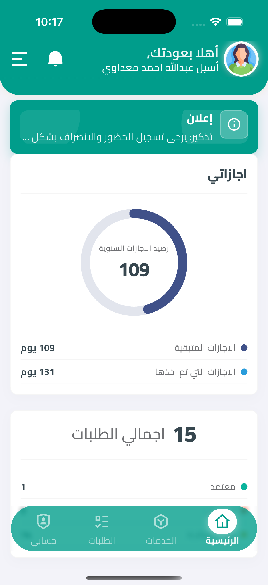
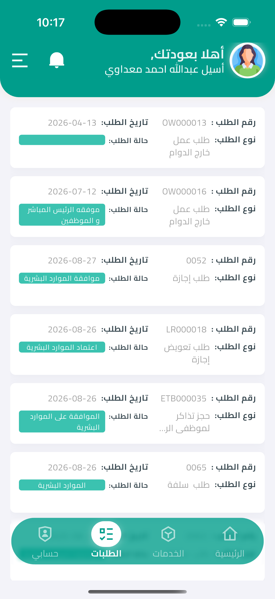
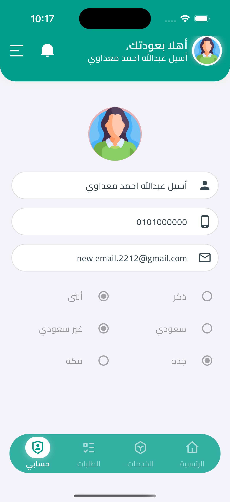
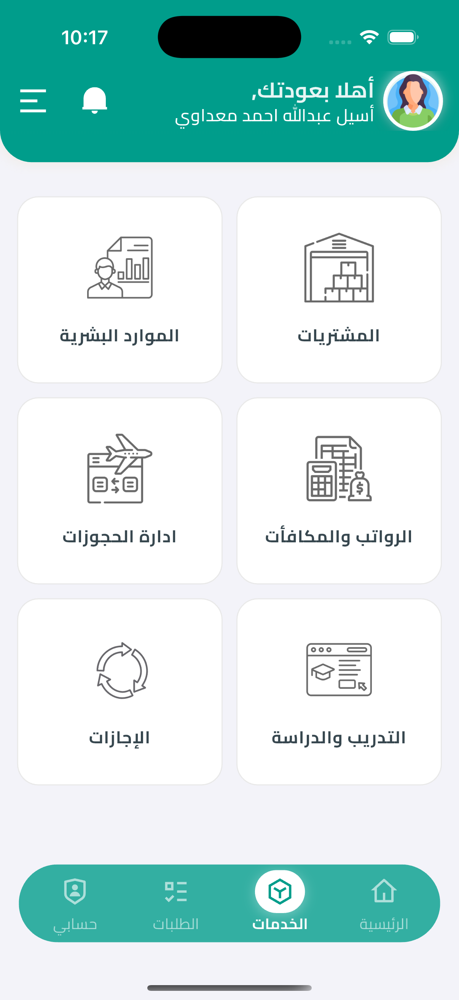
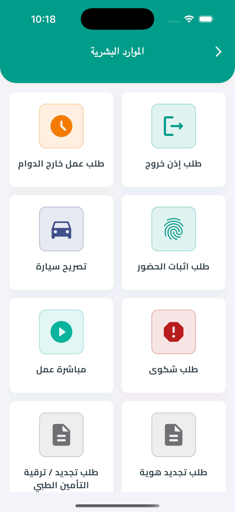
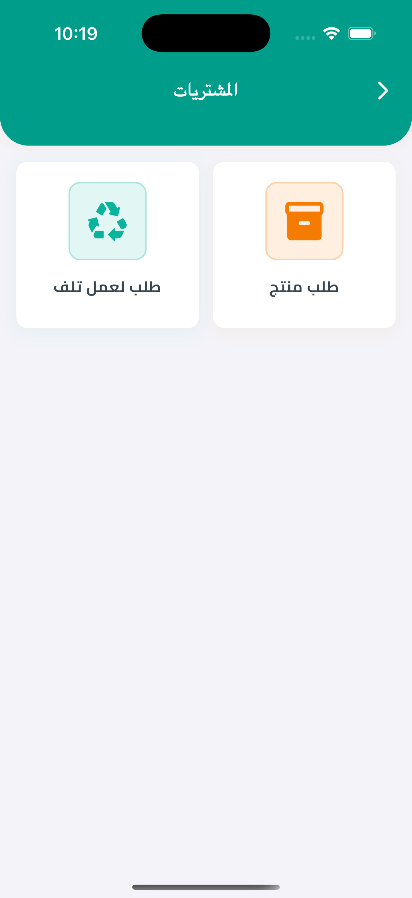
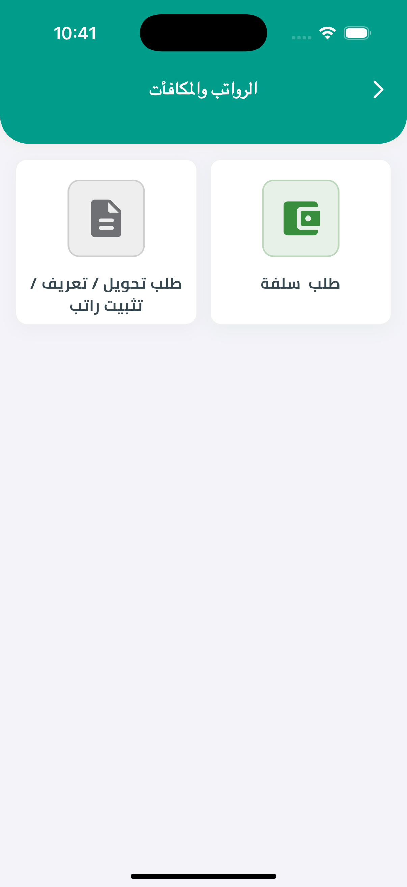
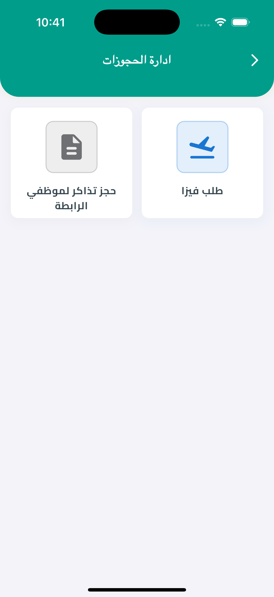
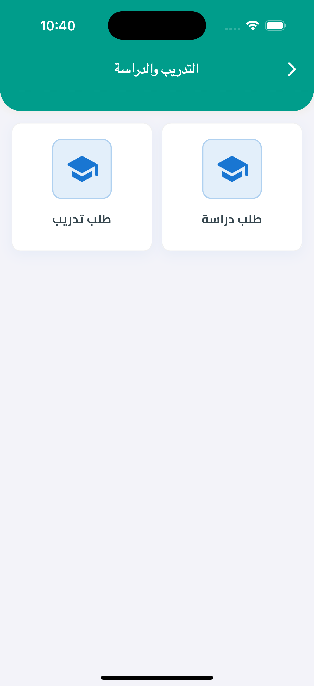
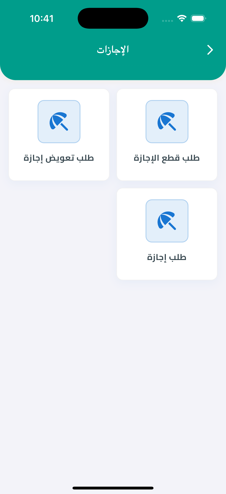

# Shaoni - Employee Services Application

[](https://flutter.dev)
[](https://dart.dev)
[](LICENSE)
[](#-supported-platforms)

Shaoni is a bilingual employee self-service application for submitting, tracking, reviewing, and approving internal company requests. It brings HR, leave, salary, purchasing, training, and travel services into one mobile workflow for two user types: employees and managers.

## 📋 Table of Contents

- [About](#-about)
- [Key Highlights](#key-highlights)
- [Architecture](#-architecture)
- [Application Experience](#-application-experience)
- [Standard Service Request Workflow](#-standard-service-request-workflow)
- [Services Catalogue](#-services-catalogue)
- [Request Management and Approvals](#-request-management-and-approvals)
- [API Integration](#-api-integration)
- [Getting Started](#-getting-started)
- [Project Structure](#-project-structure)
- [Localization](#-localization)
- [Firebase Services](#-firebase-services)
- [Development Standards](#-development-standards)
- [Testing](#-testing)
- [Supported Platforms](#-supported-platforms)
- [License](#-license)

## 🎯 About

Shaoni provides employees and managers with the same dashboard, services catalogue, personal request list, and profile experience. Managers additionally receive a **Submitted Requests** view for reviewing requests assigned to them.

### Key Highlights

- **Twenty employee services** grouped into six business categories.
- **Two user types** with a shared experience and an additional manager review view.
- **Request lifecycle tracking** with localized statuses and a visual stage timeline.
- **Create and update flows** with server-backed dropdowns and prefilled edit forms.
- **Arabic and English support** with right-to-left and left-to-right layouts.
- **Clean Architecture** using Data, Domain, and Presentation layers.
- **Cubit/BLoC state management** with dependency injection through `get_it`.
- **Firebase integration** for push notifications, analytics, and crash reporting.
- **Responsive mobile UI** based on a `430 x 932` design canvas.

## 🏗 Architecture

The application uses feature-first Clean Architecture. Presentation depends on Domain contracts, while Data implements those contracts and communicates with remote or local sources.

```text
Presentation (Screens, Widgets, Cubits)
                    │
                    ▼
Domain (Entities, Use Cases, Repository Interfaces)
                    ▲
                    │
Data (Models, Data Sources, Repository Implementations)
                    │
                    ├── REST API through Dio
                    └── SharedPreferences / session storage
```

### Layer structure per feature

```text
feature/
├── data/
│   ├── data_sources/       # Remote and local data access
│   ├── model/              # API models and serialization
│   └── repositories/       # Repository implementations
├── domain/
│   ├── entities/           # Business entities
│   ├── repositories/       # Repository contracts
│   └── use_cases/          # Application operations
└── presentation/
    ├── controller/         # Cubits and immutable states
    ├── screens/            # Route-level screens
    └── widgets/            # Feature UI sections
```

### Runtime data flow

```text
Widget → Cubit → Use Case → Repository → Data Source → API
   ▲                                                   │
   └──────────────── State / Entity / Failure ─────────┘
```

Shared infrastructure includes named routing, service-code resolution, network checking, dependency injection, local session storage, theming, validation, localization, and reusable form components.

## 📱 Application Experience

### Home dashboard

The dashboard presents the authenticated user, announcements, annual leave balance, total requests, and status statistics. Employees and managers see the same dashboard; the role difference appears in request management rather than on the Home screen.

| Employee Home | My Requests | Profile |
|---|---|---|
|  |  |  |
| Leave balance and request statistics | Request numbers, types, dates, and statuses | Employee contact and profile information |

### Main navigation

The bottom navigation provides four primary destinations:

1. **Home** - employee summary and request statistics.
2. **Services** - permitted service categories and request creation.
3. **Requests** - personal requests for every user, plus submitted requests for managers.
4. **Profile** - employee information and profile updates.

The side drawer provides access to Settings, Privacy Policy, and Logout. Settings include runtime language switching between Arabic and English.

## 🔁 Standard Service Request Workflow

The following behavior applies to every service and is documented once to avoid repeating the same instructions in each service description.

### How to open a service

1. Sign in to Shaoni.
2. Select **Services** from the bottom navigation bar.
3. Select the relevant business category.
4. Select the required service.
5. Shaoni opens the request form or, for Attendance Update, the related attendance-history screen.

Only services returned for the authenticated user by the services API are placed in the catalogue.

### Field and validation conventions

- Required fields must be completed before submission.
- Optional fields may be left empty.
- Conditional fields appear or become required after a related choice is made.
- Dropdown values are loaded from backend lookup endpoints.
- The displayed dropdown label follows the active language; the selected identifier is sent to the API.
- Date and time values are selected through application pickers and converted to the backend format.
- Read-only employee information comes from the authenticated session or user profile.
- Attachments are available only on services that support them.
- Repeatable line sections require at least one valid line before submission.
- Validation and server errors are shown through the application's standard feedback components.

In the service tables below, **Required** lists the core validated inputs. **Conditional / optional** lists fields that depend on another selection or may be omitted.

### How to submit a request

1. Complete all required and applicable conditional inputs.
2. Review the entered information.
3. Select **Submit**.
4. Shaoni validates the form and sends it to the service endpoint.
5. On success, a confirmation dialog is displayed and the request becomes available under **My Requests**.

### How to update an existing request

1. Open **Requests** and select the required employee request.
2. Select **Update** when the current stage permits employee editing.
3. Shaoni retrieves the edit model and prefills the form.
4. Modify the permitted inputs and select **Update Request**.
5. The updated request is sent to the service-specific update endpoint.

Most services are editable only during their initial stages. Leave, Study, and Training requests support additional editable pending states defined by their workflows.

### Approval behavior

- Every request begins in a new or draft state.
- The positive sequence depends on the service and may include a manager, guarantor/kafeel approval, HR, budget, external relations, or an authority holder.
- A permitted reviewer can add a comment and approve or reject a request.
- Rejection stops the positive workflow and stores the rejection reason.
- Cancellation and rejection are terminal alternatives and are omitted from the compact positive sequences below.
- The Request Details screen shows the current localized status and a visual approval timeline.

## 🧰 Services Catalogue

Services are fetched from `GET /Service/get-all-services`, normalized by technical service code, and divided into six categories.

| Service Categories | Human Resources |
|---|---|
|  |  |
| Six business areas available from the Services tab | HR attendance, permission, documents, complaints, and employee-support services |

### 👥 Human Resources

| Service | Technical code | Required inputs | Conditional / optional inputs | Positive approval sequence |
|---|---|---|---|---|
| Exit Permission | `hr.exit.permission` | Permission type, date, time, duration/processing selection | Values vary by permission type | New → Manager → HR → Done |
| Attendance Update | `attendance.update` | Missing attendance record, attendance type, applicable date/time | Check-in/check-out fields and forget reason depend on the selected record/type | Draft → Manager → Confirmed → HR → Approved |
| Car Permission | `car.permission` | Car brand, color, and number | Notes | Draft → Applied → Confirmed → HR Manager → Approved |
| Outside Working | `outside.working` | Department/project settings, attendance method, start/end dates, employees, employee tasks | Weekend, exception, private-task, and project selections | New → In Progress → Top Manager → Budget → Achievement stages → Final |
| Start Work | `start.work` | Start-work type, employee, start date | Notes | New → Confirmed → HR Manager → Approved |
| ID Renewal | `id.renewal.request` | Request type, document type, issuing country, document-specific identifiers and dates | Passport, ID, family-card, licence, kafeel, tabaq, and kafala fields depend on document type | Draft → HR Manager → Approved |
| Complaint | `complaint.request` | Complaint type, reason, and description | No update flow is currently registered | Draft → HR Manager → Approved |
| Medical Insurance Upgrade | `upgrade.medical.insurance` | Insurance class and upgrade reason | Family inclusion, selected relatives, notes | New → Confirmed → HR Manager → Employee Approval → Budget → Authority Holder → Approved |
| Experience Certificate | `experience.certificate` | Certificate reason and request reason | Additional explanation | New → Confirmed → Approved |

Human Resources uses lookup endpoints for permission types, attendance data, forget reasons, cars, employees, countries, document types, insurance classes, relatives, departments, projects, complaint classifications, and other service-specific values.

### 📦 Purchases and Repositories

| Product and Scrap Services |
|---|
|  |
| Product ordering and controlled scrap/disposal requests |

| Service | Technical code | Required inputs | Conditional / optional inputs | Positive approval sequence |
|---|---|---|---|---|
| Product Order | `product.request` | Request reason and at least one category/product/quantity line | Notes and additional request lines | Draft → Confirmed → Specifications → Approved → Closed |
| Scrap Request | `scrap.request` | Custody, stock request, scrap reason, request reason, and at least one product/lot/quantity line | Additional lines and line-dependent lots | Backend-defined stages |

Both forms support repeatable request lines. Product options depend on the selected category, while scrap lots depend on the selected stock/product context.

### 💰 Salaries and Bonuses

| Salary Services |
|---|
|  |
| Salary documents/transfers and employee loan requests |

| Service | Technical code | Required inputs | Conditional / optional inputs | Positive approval sequence |
|---|---|---|---|---|
| Salary Request / Transfer | `new.salary.transfer` | Request type and the applicable salary/document selections | Bank country, bank, account, IBAN, letter destination, reason, and notes depend on request type | New → Confirmed → Approved |
| Loan Request | `hr.loan` | Loan type, amount, repayment period, and first installment date | Guarantor is required when the loan type needs one | Draft → Kafeel/Guarantor → HR → HR Approval |

### ✈️ Reservation Management

| Travel Services |
|---|
|  |
| Employee visa and ticket-booking workflows |

| Service | Technical code | Required inputs | Conditional / optional inputs | Positive approval sequence |
|---|---|---|---|---|
| Visa Request | `visa.request` | Visa type, language, destination, reason, employees, and employee dates | Notes and attachments | Draft → Confirmed → HR → External Relations → Authority Holder → Approved |
| Employee Ticket Booking | `employee.ticket.booking` | Ticket type/class and at least one employee itinerary with travel date | Multiple employees, inbound/outbound information, notes, and general attachments | Draft → Confirmed → HR → Approved |

### 🎓 Training and Education

| Training Services |
|---|
|  |
| Study requests and employee course nominations |

| Service | Technical code | Required inputs | Conditional / optional inputs | Positive approval sequence |
|---|---|---|---|---|
| Study Request | `study.request` | Study type, destination, requested study, start/end dates, duration, and justification | Duration comment and supporting explanation | Draft → Applied → HR Manager → Authority Holder → Approved/Confirmed |
| Training Request | `training.request` | Course and applicable course/nomination dates and periods | Course details and notes | Draft → Confirmed → Approved |

### 🗓️ Leaves

| Leave Services |
|---|
|  |
| Standard leave, leave replacement, and leave interruption |

| Service | Technical code | Required inputs | Conditional / optional inputs | Positive approval sequence |
|---|---|---|---|---|
| Leave Request | `hr.leave` | Leave type and start/end dates | Alternative employee, attachments, and pre-booked leave information | Draft → Confirmed → Manager → HR → Approved |
| Leave Replacement | `leave.replace` | Leave type, selected leave, and replacement start/end dates | The leave list depends on the selected leave type | Draft → Confirmed → HR → Approved |
| Leave Interruption | `leave.interruption.request` | Leave type, selected leave, interruption type/date, and justification | Attachments | Draft → HR → Approved |

## ✅ Request Management and Approvals

### User types

Shaoni has two application user types:

| Employee | Manager |
|---|---|
| Uses the standard dashboard, services catalogue, **My Requests**, and profile screens. | Uses the same dashboard and application screens, with an additional **Submitted Requests** tab for manager review. |

The role does not change the Home dashboard layout. It changes the available request tabs and review actions.

| Employee Request View | Manager Request View |
|---|---|
|  |  |
| Employees see requests they submitted. | Managers can switch between their own requests and requests submitted for their review. |

### Employee requests

Employees and managers always receive a **My Requests** view containing request number, service, creation date, and current status. Requests support pagination and filtering by service.

Selecting a request opens service-specific details, attachments where available, the current stage, and the approval timeline. An Update button is displayed only when the current stage is employee-editable.

### Manager requests

Users whose employee record identifies them as managers receive the additional **Submitted Requests** tab shown above. When a request is waiting at the applicable manager stage, the reviewer can:

- Read all service-specific details.
- Add a review comment.
- Approve or reject the request.
- Open the service edit flow when manager editing is supported.

A kafeel may still participate as a guarantor in a service workflow such as a loan, but this is an approval responsibility rather than a separate documented application user type.

### Status timeline

Shaoni converts backend technical states such as `draft`, `confirmed`, `hr_approval`, `approved`, and `reject` into localized workflow steps. Service-specific timelines are defined centrally so the request list, details screen, and review controls use the same interpretation.

## 🔌 API Integration

Shaoni communicates with a versioned REST API through Dio. The host is configured in `lib/core/constants/api_constants.dart` and should be environment-managed for production deployments.

### Request headers

Authenticated requests include:

```http
Authorization: Bearer <access-token>
App-Language: ar|en
```

### Primary endpoint groups

| Area | Representative endpoints |
|---|---|
| Authentication | `POST /Auth/login`, `POST /User/otp/request`, `POST /User/otp/verify`, `POST /User/reset-password` |
| User/Profile | `GET /User/{id}`, profile update, account deletion |
| Service catalogue | `GET /Service/get-all-services` |
| Dashboard | Request status counts and annual leave balance |
| Employee requests | `GET /Request/dashboard/paged/by-user` |
| Manager requests | `GET /Request/dashboard/paged/for-manager` |
| Request details | `GET /Request/{id}/with-stages` |
| Review action | `POST /Request/status/{id}` |
| Lookups | Service-specific values under `/Lookup` and `/Integration` |

Each service owns create, update, edit-prefill, and lookup endpoints in the matching data source. API models remain in the Data layer and are exposed to the application through Domain entities.

### Error handling

- Network and backend problems are converted into application `Failure` objects.
- Cubits expose loading, success, validation, pagination, and error states.
- Debug builds use Dio request/response logging.
- Write operations require connectivity; the application does not queue offline submissions.

## 🚀 Getting Started

### Prerequisites

- Flutter SDK `3.29.1` or a compatible newer stable release.
- Dart SDK `3.7.0` or compatible.
- Android Studio or VS Code with Flutter support.
- Xcode and CocoaPods for iOS development.
- A valid backend environment and Firebase configuration for the target application IDs.

### Installation

1. Clone the repository:

   ```bash
   git clone https://github.com/Amr8tom/Shaoni.git
   cd Shaoni
   ```

2. Install dependencies:

   ```bash
   flutter pub get
   ```

3. Generate localization files after changing ARB resources:

   ```bash
   dart run intl_utils:generate
   ```

4. Confirm that Firebase files are available:

   ```text
   android/app/google-services.json
   ios/Runner/GoogleService-Info.plist
   lib/firebase_options.dart
   ```

5. Run the application:

   ```bash
   flutter run
   ```

### Release configuration

Android release signing reads `android/key.properties`. Keep the keystore and its credentials outside version control.

```properties
storeFile=/absolute/path/to/release-keystore.jks
storePassword=<store-password>
keyAlias=<key-alias>
keyPassword=<key-password>
```

Build commands:

```bash
# Android app bundle
flutter build appbundle --release

# Android APK
flutter build apk --release

# iOS archive prerequisites
cd ios
pod install
cd ..
flutter build ios --release
```

## 📁 Project Structure

```text
shaoni/
├── android/                       # Android application and release configuration
├── ios/                           # iOS runner and CocoaPods configuration
├── assets/                        # Images, SVGs, Lottie files, audio, and fonts
├── lib/
│   ├── common/                    # Reusable widgets and shared UI helpers
│   ├── core/
│   │   ├── connection/            # Connectivity and application update checks
│   │   ├── constants/             # API, assets, service codes, colors, and sizes
│   │   ├── dio/                   # HTTP client
│   │   ├── error/                 # Failure types
│   │   ├── local_storage/         # Preferences and session storage
│   │   ├── routing/               # Routes and service route resolver
│   │   ├── service_locator/       # get_it registrations
│   │   ├── theme/                 # Application themes
│   │   └── utils/                 # Validators, helpers, and use-case base types
│   ├── features/
│   │   ├── app/                   # Root MaterialApp
│   │   ├── auth/                  # Login, OTP, and password management
│   │   ├── booking_managment/     # Visa and ticket services
│   │   ├── details_and_edit_for_requests/
│   │   ├── home/                  # Dashboard and statistics
│   │   ├── human_resources/       # HR service forms
│   │   ├── language/              # Runtime locale management
│   │   ├── leaves/                # Leave workflows
│   │   ├── navigation/            # Main shell and user data
│   │   ├── notifications/         # Notification UI
│   │   ├── profile/               # Employee profile
│   │   ├── salaries/              # Salary and loan services
│   │   ├── services/              # Catalogue and category grouping
│   │   ├── settings/              # Application settings
│   │   └── study&training/        # Study and training services
│   ├── generated/                 # Generated localization output
│   ├── l10n/                      # English and Arabic ARB resources
│   └── main.dart                  # Firebase, DI, permissions, and application startup
├── test/                          # Flutter tests
├── firebase.json                  # FlutterFire application mapping
└── pubspec.yaml                   # Dart packages, assets, and fonts
```

### Central service dispatch

New backend services must be connected through the shared dispatch points:

- `lib/core/constants/service_codes.dart`
- `lib/features/services/domain/entity/services_names.dart`
- `lib/core/routing/service_route_resolver.dart`
- `lib/core/routing/routes.dart`
- `lib/features/details_and_edit_for_requests/presentation/helpers/get_request_details_widget.dart`
- `lib/features/details_and_edit_for_requests/domain/enums_and_extentions/request_enums.dart`
- The applicable service locator and feature repository.

See `SERVICE_IMPLEMENTATION_GUIDE.md` for the project-specific implementation checklist.

## 🌍 Localization

Shaoni supports English and Arabic:

```text
lib/l10n/intl_en.arb
lib/l10n/intl_ar.arb
```

To add a localized string:

1. Add the same key to both ARB files.
2. Provide the correct English and Arabic values.
3. Regenerate localization output:

   ```bash
   dart run intl_utils:generate
   ```

4. Use `S.current.<key>` in the existing localization pattern.
5. Test both left-to-right and right-to-left layouts.

The selected locale is cached locally and is also sent to the API through the `App-Language` header.

## 🔥 Firebase Services

Application startup initializes Firebase before rendering the UI. The current integration includes:

- **Firebase Cloud Messaging** for remote push notifications.
- **Flutter Local Notifications** for device-side notification presentation.
- **Firebase Crashlytics** for Flutter error reporting.
- **Firebase Analytics** for application analytics.

Notification permission is requested during startup. Platform Firebase configuration is mapped through `firebase.json` and the standard Android/iOS service files.

## 📋 Development Standards

- Keep dependency direction as `presentation → domain` and `data → domain`.
- Domain repositories and use cases return entities, never Data-layer models.
- Keep JSON parsing and serialization in the Data layer.
- Widgets render state and call Cubit methods; they do not call APIs or repositories.
- Add backend service codes through `ServiceCode` rather than comparing raw strings throughout the UI.
- Use centralized route resolution for service create and update flows.
- Use application colors, spacing, themes, and shared form widgets.
- Localize every user-facing string in both supported languages.
- Keep release credentials, tokens, and private environment configuration out of source control.
- Update service documentation when fields, endpoints, or approval stages change.

### Development workflow

1. Create a feature branch.
2. Copy the closest existing service architecture when adding a related workflow.
3. Implement Domain contracts before Data and Presentation details.
4. Register dependencies in the applicable service locator.
5. Add routing, details dispatch, editing, localization, and approval-stage mapping.
6. Run formatting, analysis, and tests.
7. Update documentation and submit a focused pull request.

## 🧪 Testing

Run the standard Flutter quality checks before opening a pull request:

```bash
dart format --set-exit-if-changed lib test
flutter analyze
flutter test
```

Important request flows should cover:

- Successful and failed lookup loading.
- Required and conditional field validation.
- Create and update payload mapping.
- Edit-prefill behavior.
- Service-code route and details dispatch.
- Employee and manager visibility rules.
- Approval-stage interpretation.
- Arabic and English layouts.

## 📱 Supported Platforms

- **Android:** API 24+; the current Android project compiles and targets API 36.
- **iOS:** iOS 15.0+ as configured in the Podfile.

## 📄 License

This project is available under the [MIT License](LICENSE).

---

Built with Flutter for employee self-service and internal request management.
